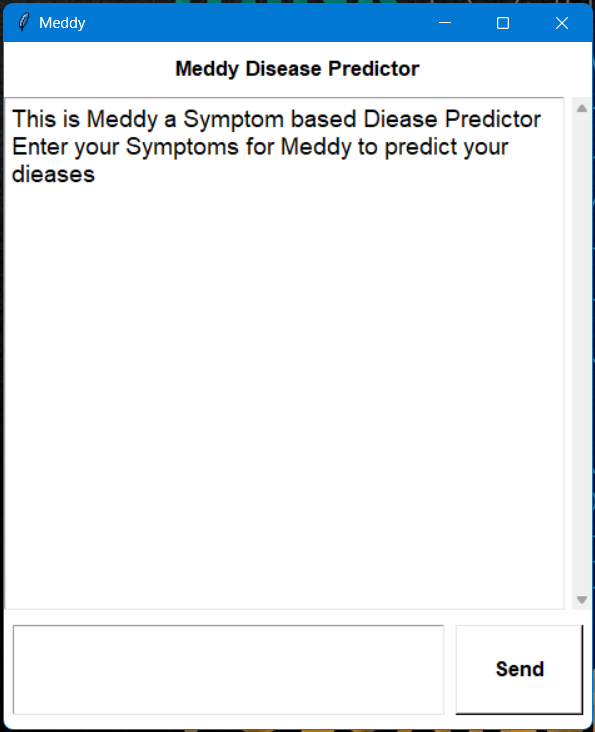
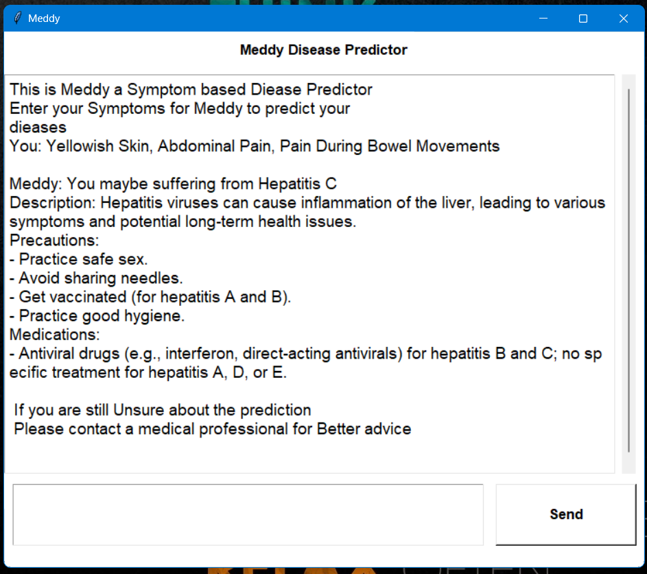

# Meddy: Disease Prediction Application

Meddy is an innovative disease prediction application that leverages the power of machine learning to predict diseases based on user-reported symptoms. With Meddy, you can quickly and easily get insights into potential health issues, enabling you to take proactive steps towards a healthier life. This README provides an overview of Meddy's features, usage, precautions, and available medications.

## Table of Contents

- [Features](#features)
- [Installation](#installation)
- [Usage](#usage)
- [Precautions](#precautions)
- [Available Medications](#availablemedications)
- [Screenshots](#screenshots)

---

## Features

### 1. Symptom-Based Disease Prediction
Meddy uses a comprehensive database of symptoms and their correlations with various diseases. Users can input their symptoms, and the application employs advanced machine learning algorithms to provide a list of potential diseases.

### 2. User-Friendly Interface
Our intuitive and user-friendly interface ensures that anyone, regardless of their tech-savviness, can easily navigate and use the application.

### 3. Fast and Reliable
Meddy is designed for quick and reliable disease predictions. Within seconds, you'll receive a list of possible diseases based on the symptoms provided.

### 4. Health Recommendations
Based on the predicted diseases, Meddy offers health recommendations, including lifestyle changes and preventative measures.

### 5. Medication Information
Find detailed information about the medications associated with specific diseases, including dosage instructions and potential side effects.

---
## Installation

To get started with Meddy, follow these installation steps:

1. **Clone the Repository**:
   ```
   git clone https://github.com/yourusername/meddy.git
   ```

2. **Navigate to the Meddy Directory**:
   ```
   cd meddy
   ```

3. **Install Dependencies**:
   Use pip to install the required Python packages:
   ```
   pip install -r requirements.txt
   ```

4. **Launch the Application**:
   Open the VS Code Editor and open the ipynb file and execute the Cells one by one

---


## Usage

Using Meddy is straightforward:

1. **Launch the Application**: Open the Meddy application on your device.

2. **Symptom Input**: Enter your symptoms into the application. You can select from a predefined list or manually input your symptoms.

3. **Get Predictions**: Click the "Predict" button, and Meddy will provide a list of potential diseases based on your symptoms.

4. **Explore Recommendations**: For each predicted disease, explore recommended precautions and lifestyle changes to improve your health.

5. **Medication Information**: If a disease is predicted, you can also find detailed information about available medications, including dosage and side effects.

---

## Precautions

While Meddy is a valuable tool for initial disease prediction, it is essential to keep the following precautions in mind:

- **Consult a Healthcare Professional**: Meddy's predictions are not a substitute for professional medical advice. Always consult a healthcare provider for a confirmed diagnosis and treatment plan.

- **Privacy and Security**: Protect your personal health information. Ensure that your data is secure and that you are using a trusted and reputable application.

- **Regular Check-ups**: Even if Meddy predicts a minor issue, regular check-ups with a healthcare provider are crucial for maintaining your health.

---

## Available Medications

Meddy provides information about a wide range of medications used to treat various diseases. While the application can offer insights into available medications, always follow your healthcare provider's recommendations for medication usage.

For specific details about medications and their usage, please refer to the application.

---

## Screenshots

Here are some screenshots from the Meddy application:

**Screenshot 1: Home Screen**



**Screenshot 2: Symptom Input & Dieases prediction & Medical suggestions**



Thank you for choosing Meddy to empower your healthcare decisions!


For more information about Meddy, including updates, support, and frequently asked questions, please visit our website or contact our support team.

Website: [www.meddyapp.com](https://www.meddyapp.com)
Support: [support@meddyapp.com](mailto:support@meddyapp.com)

Thank you for choosing Meddy to empower your healthcare decisions!
